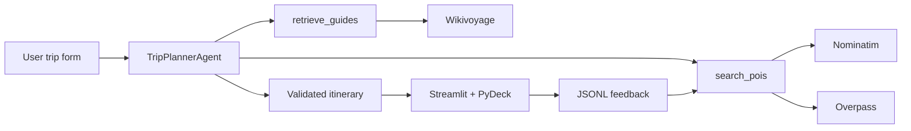

# Trip Planner AI Agent

**An AI Engineering / Automation Portfolio Project** 
*By Randall James | Data Analyst & Project Coordinator*

Production-style Streamlit trip planner built as a Codecademy AI engineering capstone.

The app does more than chat. An agent calls tools against live OpenStreetMap data, optionally retrieves Wikivoyage context with TF-IDF RAG, validates that every stop is a real POI, and lets you refine the plan in natural language.

## Features

- **Agentic planning** with OpenAI’s Responses API and strict function schemas
- **Live POI search** via Nominatim geocoding + Overpass OSM queries
- **Optional Wikivoyage RAG** (chunking + scikit-learn TF-IDF retrieval)
- **Itinerary validation** so the model cannot invent `poi_id` values
- **Interactive PyDeck map** with day filters, markers, and path layers
- **Natural-language refinement** for the full trip or a single day
- **Feedback loop** (upvote / downvote) that boosts future POI ranking
- **Session persistence** to `data/app_state.json`
- **Fast mode**, model picker, and an execution-trace viewer

## Architecture

```text
Streamlit UI (app.py)
        |
        v
TripPlannerAgent  -- Responses API (function calling)
        |
        |-- search_pois
        |       |-- Nominatim geocode
        |       |-- Overpass POI query
        |       +-- feedback boost ranking
        |
        |-- retrieve_guides (optional)
        |       |-- Wikivoyage extract
        |       +-- TF-IDF top-k chunks
        |
        +-- validate + enrich itinerary JSON
                +-- PyDeck map + JSON export
```



## Project structure

```text
trip-planner-ai-agent/
|-- app.py                 # Streamlit entry point
|-- src/
|   |-- agent.py           # Responses API loop + tool routing
|   |-- pois.py            # OSM interest mapping + Overpass
|   |-- geocoding.py       # Nominatim
|   |-- rag.py             # Wikivoyage RAG
|   |-- feedback.py        # JSONL votes + boost scores
|   |-- validation.py      # JSON extract + POI-id checks
|   |-- maps.py            # PyDeck layers
|   +-- persistence.py     # app_state.json
|-- data/                  # local state (gitignored)
|-- examples/
|-- tests/
+-- requirements.txt
```

## Setup

Python 3.10+ recommended.

### macOS / Linux

```bash
git clone https://github.com/senseirandystl/trip-planner-ai-agent.git
cd trip-planner-ai-agent

python -m venv trip-planner-env
source trip-planner-env/bin/activate
pip install -r requirements.txt
python -m streamlit run app.py
```

### Windows (Command Prompt)

`source` is a Unix command and will fail in `cmd.exe`. Use the venv `Scripts` folder instead:

```bat
E:
cd \Github\trip-planner-ai-agent

python -m venv trip-planner-env
trip-planner-env\Scripts\activate.bat
python -m pip install -r requirements.txt
python -m streamlit run app.py
```

If the prompt shows `(trip-planner-env)` you are in the virtual environment. After that, `python` and `pip` stay inside the venv even if `Scripts` is not on PATH.

PowerShell equivalent:

```powershell
E:\Github\trip-planner-ai-agent\trip-planner-env\Scripts\Activate.ps1
```

If PowerShell blocks the script, run `Set-ExecutionPolicy -Scope CurrentUser RemoteSigned` once, or stay in Command Prompt.

Paste an OpenAI API key in the sidebar, or set it for the current session:

```bat
set OPENAI_API_KEY=sk-...
```

For Streamlit Cloud, put the key in `.streamlit/secrets.toml` (never commit that file):

```toml
OPENAI_API_KEY = "sk-..."
```

## APIs

| Service | Auth | Notes |
| --- | --- | --- |
| OpenAI Responses API | API key | Default model `gpt-4.1-mini`. Typical itinerary is a few cents. |
| Nominatim | none | Requires a descriptive `User-Agent` and ~1 req/s. |
| Overpass | none | Live OSM POIs. Queries are retried with backoff. |
| Wikivoyage | none | Optional. Disable in the sidebar if you hit 403s. |

Update the OSM User-Agent in the sidebar so it includes a real contact address.

## Usage

1. Enter destination, days, pace, and interests.
2. Click **Generate itinerary**.
3. Inspect the day/block plan, vote on stops, and open the map tab.
4. Refine with requests like “make day 2 more outdoorsy” or “fewer restaurants.”
5. Download the itinerary JSON.

Fast mode calls `search_pois` once with a broader limit. Deep mode allows 2–3 targeted searches.

## Validation and feedback

The agent is not trusted blindly:

- Final JSON is parsed and every `poi_id` must exist in the tool catalog.
- Single-day refinements are checked so other days stay byte-for-byte unchanged.
- Votes are stored in `data/feedback.jsonl` as `{ts, city_key, poi_id, vote}`.
- Ranking applies `+0.25` per upvote and `-0.35` per downvote, scoped by city.

## Tests

```bash
python -m unittest discover -s tests -v
```

## Known limitations

- OSM coverage varies by city; sparse destinations return fewer stops.
- Nominatim / Overpass rate limits can slow first-time geocodes.
- Wikivoyage may reject some User-Agent strings (toggle RAG off).
- The planner does not book hotels, flights, or timed tickets.
- There is no multi-user auth — persistence is local-file based.

## Future ideas

- Weather-aware day ordering
- Budget estimates per block
- PDF / shareable itinerary export
- Saved trips behind authentication

**About Me**  
Randall James | Data Coordinator / Data Analyst / Project Manager  
St. Louis, MO (O'Fallon area) | Open to remote, hybrid, or on-site within ~30 min commute  
[LinkedIn](https://www.linkedin.com/in/randall-james-stl) | [GitHub](https://github.com/senseirandystl) | randalljames34@pm.me

*This project was created as part of my professional portfolio to demonstrate AI Engineering / Automation capabilities.*

Built for the Codecademy Trip Planner AI Agent capstone. Map data © OpenStreetMap contributors. Travel text from Wikivoyage when RAG is enabled.

## License

MIT
